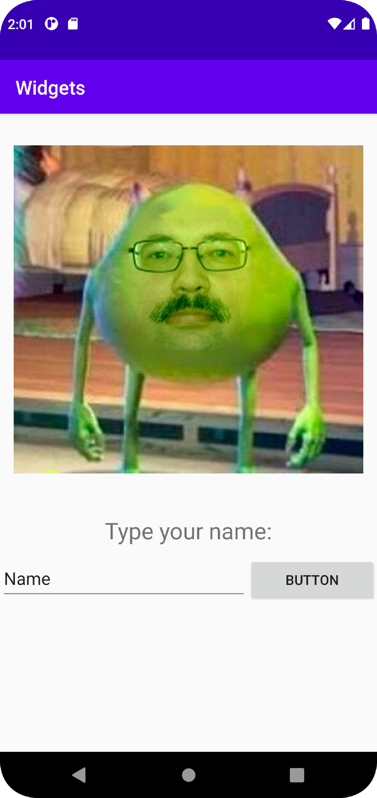

# Rapport

  **Rapport - Raman Mohammed**
  
I started with creating two linearlayouts**activity_main.xml** with the help of the design function which Android Studios provide.
  The first layout will be our root layout which purpose is show the element from upwards and downwards and to take upp the whole screen, which is why it got match_parent.
  
```
    android:layout_width="match_parent"
    android:layout_height="match_parent"
    android:orientation="vertical"
    android:id="@+id/root_layout"
```
  
  The layout is also ID to **android:id="@+id/root_layout"**. To simplify the design of putting elements inside of layouts.
  
Inside of **Root_layout** there is two element. One is a image, the other one is a textview. Both have been centered with gravity. The image has also gotten extra padding for designing purposes. The text also has increased in size for easier readability.
I have also used wrap_content so each element doesn't take to much space, only within their required size.
    ```
        <ImageView
        android:id="@+id/imageView"
        android:layout_width="wrap_content"
        android:layout_height="wrap_content"
        android:layout_gravity="center_horizontal"
        android:padding="14dp"
        android:src="@drawable/green_sample" />
    ```

    ```
        <TextView
        android:layout_width="wrap_content"
        android:layout_height="wrap_content"
        android:layout_gravity="center_horizontal"
        android:layout_marginTop="10dp"
        android:text="@string/type_your_name"
        android:textSize="24sp"
        app:layout_constraintBottom_toBottomOf="parent"
        app:layout_constraintLeft_toLeftOf="parent"
        app:layout_constraintRight_toRightOf="parent"
        app:layout_constraintTop_toTopOf="parent" />
    ```
  
  The other layout is assigned to show horizontal which will hold a button and a edit text. Reasoning behind why it required another element is because a horizontal line will share with serveral element.
This requires that we add another layout when there is two or more element in same horizontal line.

```    
<LinearLayout
    android:id="@+id/first_horizontal"
    android:layout_width="match_parent"
    android:layout_height="match_parent"
    android:orientation="horizontal">
```

In the button and edittext, there has been added top margin to give some space between picture. I also added **layout_weight** so button and edittext share 50-50 of the layout.
They're wrapped in wrap_content, so they wouldn't take unnecessary vertical size.

```
    <EditText
    android:id="@+id/editTextTextPersonName"
    android:layout_width="wrap_content"
    android:layout_height="wrap_content"
    android:layout_marginTop="10dp"
    android:layout_weight="1"
    android:ems="10"
    android:inputType="textPersonName"
    android:minHeight="48dp"
    android:text="@string/name" />
```

```
    <Button
    android:id="@+id/button"
    android:layout_width="wrap_content"
    android:layout_height="wrap_content"
    android:layout_marginTop="10dp"
    android:layout_weight="1"
    android:text="@string/button" />
```

 
   
 
        
  



